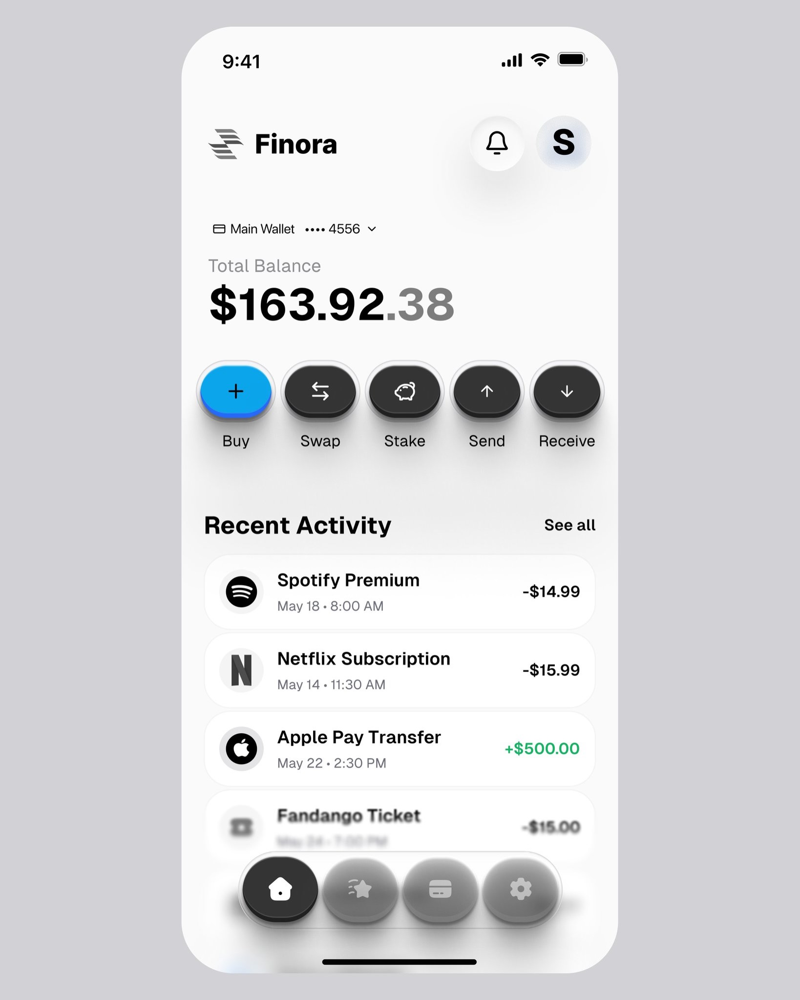
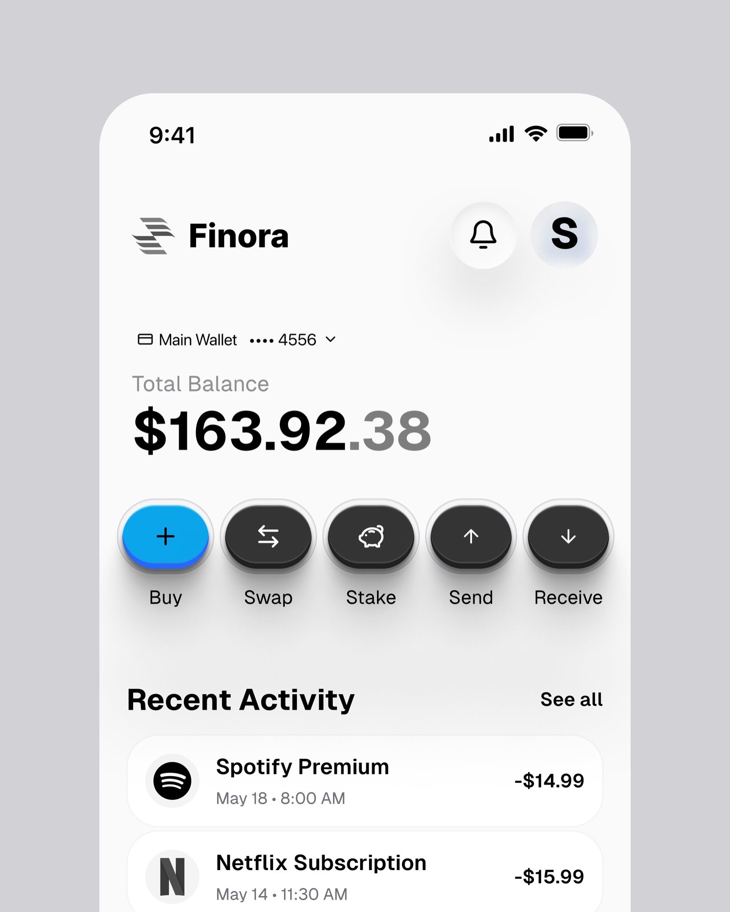
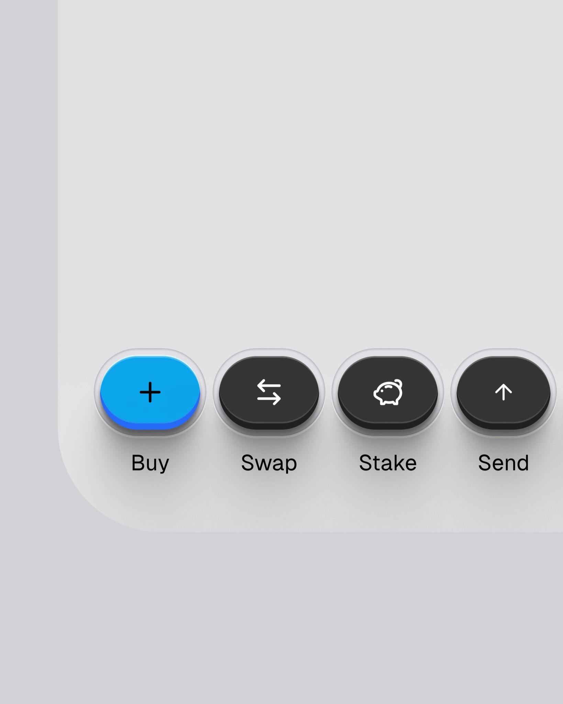

# 💸 Expense Tracker - Home Screen UI Challenge

A pixel-perfect, modern mobile application home screen built with **Flutter**. This project is part of a UI implementation challenge focused on replicating high-fidelity, 3D soft-embossed (neumorphic/skeuomorphic hybrid) design elements with realistic shadows, gradients, and custom micro-interactions.

---

## 📱 App Screenshots

<p align="center">
  
  
  
</p>

---

## ✨ Key UI & Engineering Highlights

* **Neumorphic & 3D Lighting Effects:** Custom layered `BoxShadow` configurations and `RadialGradient` overlays to achieve realistic top-inner shadows and soft ambient floor shadows.
* **Pixel-Perfect Fidelity:** High attention to typography, spacing, component proportions, and iconography.
* **Custom Micro-Interactions:** Custom scale animations on action buttons triggered by touch events (`GestureDetector` with `AnimationController`).
* **Cross-Platform Readiness:** Custom status bar and navigation bar system overlay styling configured for seamless display on both iOS and Android.

---

## 🛠️ Built With

* **Framework:** [Flutter](https://flutter.dev) (Dart)
* **Navigation:** [GoRouter](https://pub.dev/packages/go_router)
* **Design Pattern:** Component-driven architecture with custom dynamic button builders

---

## 🚀 Getting Started

### Prerequisites

* Flutter SDK (`>=3.0.0`)
* Android Studio / Xcode (for emulators/simulators)

### Installation

1. **Clone the repository:**
   ```bash
   git clone [https://github.com/your-username/expense_tracker.git](https://github.com/your-username/expense_tracker.git)
   cd expense_tracker